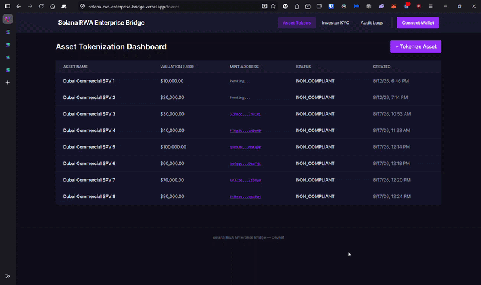

# Hi there👋, I'm Michele      

# ⚡ Senior Solana Integration Engineer & Architect

I design and build production-grade **Solana integrations across the entire software stack**—bridging traditional enterprise backends with high-throughput Web3 rails. With 5+ years of software engineering experience ranging from high-throughput enterprise systems to leading agile engineering pods, I deliver end-to-end blockchain architectures: from **zero-dependency pure-Java wire transaction serialization** and institutional compliance engines to responsive **Web dApps** and **Solana Mobile (SMS/MWA)** implementations.

### 📌 Current Availability & Engagement Terms
I am currently opening a select window for high-performance teams and institutional builders to leverage my integration expertise. If your project demands elite-level execution, you have the opportunity to secure my availability under the following parameters:

*   **The Blueprint:** End-to-End Solana Integration (Enterprise Backend Rails, Web dApps, or Mobile)
*   **The Role:** Senior Solana Integration Engineer / Web3 Solutions Architect / Enterprise Consultant
*   **Engagement:** 3–6 Month Contracts (Sprint, Milestone, or Advisory-based execution)
*   **Timeline:** Available immediately for the right project.
*   **Synchronization:** Full-time Remote with **100% overlap with US Eastern Time (EST) hours**.

### 🤝 What I Bring to Your Pod
I do not just write code; I design fail-closed architectures, eliminate external dependency bloat, and accelerate shipping timelines for Agile Web3 teams. Whether you are tokenizing real-world assets (RWAs), building low-latency indexers/adapters, or launching a consumer dApp, let’s talk.

---

### 🛠️ My Technical Toolkit

*   **1. Enterprise Core & Protocol Integration (Backend First):**
    *   **Low-Level Solana Serialization:** Custom zero-dependency pure-Java wire serializer (`SolanaTransactionSerializer`) supporting compact-u16 varints, canonical 4-category account classification, and legacy wire message generation.
    *   **Cryptography & RPC:** Pure Ed25519 multi-signing (`net.i2p.crypto:eddsa`), dynamic rent exemption calculation (`getMinimumBalanceForRentExemption`), confirmed commitment retry engine, and resilient JSON-RPC adapters.
    *   **Enterprise Architecture:** Java 21, Spring Boot 3.5, Hibernate/JPA, PostgreSQL, Docker, fail-closed KYC/AML compliance gatekeepers, and append-only audit trail logging.

*   **2. Web3 Frontend & Responsive dApps:**
    *   Modern standalone frontend architecture with **Angular 18+** / **React**, TypeScript, Tailwind CSS, and RxJS state streams.
    *   Browser wallet integrations (`@solana/web3.js`, Phantom, Solflare), self-custody transaction signing, and dynamic explorer linking.

*   **3. Native & Cross-Platform Mobile:**
    *   **Solana Mobile:** Solana Mobile Stack (SMS), Mobile Wallet Adapter (MWA) integrations, seed vaults, and native Web3 wallet flows.
    *   **Mobile Frameworks:** Native Android (Kotlin, Java), React Native, memory optimization, low-latency state caching, and responsive UI.

*   **4. Agile Engineering Leadership:**
    *   Certified Professional Scrum Master (PSM I), test-driven development (TDD), CI/CD pipelines, and active sprint management to eliminate technical blockers.

---

### 🚀 Production Proof-of-Work & Open-Source Projects

  

    <h4>🌉 solana-rwa-enterprise-bridge</h4>
    
Enterprise-grade bridge connecting off-chain Spring Boot infrastructure (KYC/AML compliance gatekeeper, immutable audit trail, PostgreSQL) directly to Solana Devnet RPC. Features a pure-Java binary transaction wire serializer, dynamic rent exemption, and atomic 2-instruction SPL token minting with 107 passing backend tests.

    
<a href="https://github.com/msantagiulianab/solana-rwa-enterprise-bridge">https://github.com/msantagiulianab/solana-rwa-enterprise-bridge</a>

    

  

  

    <h4>⚡ solana-staker-mobile</h4>
    
Mobile-first staking solution tailored for the Solana ecosystem, leveraging the Solana Mobile Stack (SMS) and Mobile Wallet Adapter to deliver seamless, native self-custody Web3 interactions.

    
<a href="https://github.com/msantagiulianab/solana-staker-mobile">https://github.com/msantagiulianab/solana-staker-mobile</a>

    

  

  

    <h4>📊 Crypto Listings</h4>
    
Real-time digital asset intelligence application featuring high-refresh market data tracking, fluid UI animations, and optimized data serialization for cryptocurrency streams.

    
<a href="https://github.com/msantagiulianab/CryptoListingsApp">https://github.com/msantagiulianab/CryptoListingsApp</a>

    

  

---

### 📊 Engineering Achievements & Core Differentiators

*   **Zero-Dependency Wire Protocol Engine:** Architected and implemented a pure-Java Solana transaction serializer and Ed25519 multi-signer, removing heavy external Web3 SDK bloat for enterprise microservices.
*   **Fail-Closed Compliance Gatekeeping:** Built strict regulatory guardrails that prevent unverified wallets from ever hitting the Solana RPC layer, logging all decisions to an immutable, append-only PostgreSQL audit trail.
*   **Multi-Surface Execution:** Successfully deployed production architectures across Enterprise Java/Spring Boot backends, Angular web dApps, and Solana Mobile Stack native/hybrid applications.

---

### 🤝 Connect with Me

I am available for high-impact consulting contracts (3–6 months) and senior integration roles with teams looking to bridge enterprise infrastructure or ship high-performance Solana applications.

